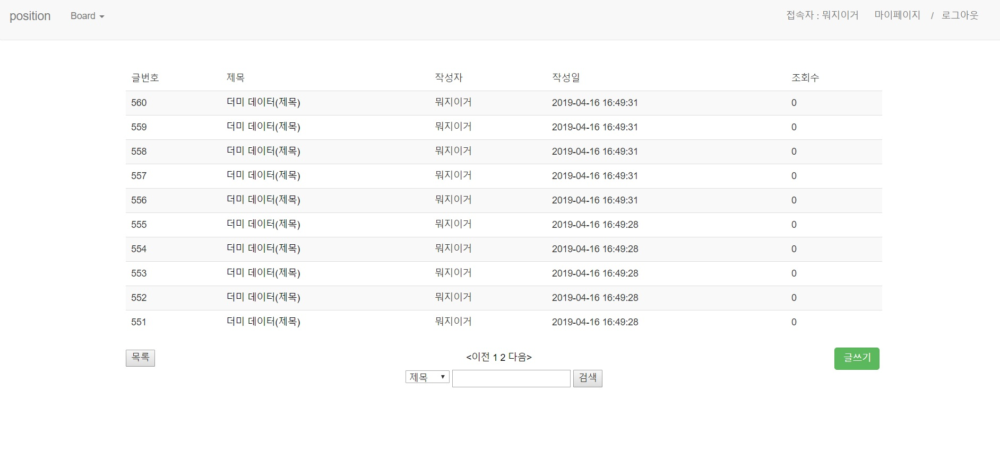

## 목적
* 어떤 웹에서도 필수적인 회원,게시판 기능을 Spring으로 만들어 보기 위함
* 필수적인 회원과 게시판 기능을 모듈로 만들어 어디서든 사용 할 수 있게 만들어 보고자함.

## 개발환경
### Front-End
* Bootstrap 3
* Jquery 3

### Back-End

* Spring 3.1
* JDK 1.8
* Oracle 11g
* Mybatis 3.1
* Tomcat 8
* Maven 2.9

## 제작기간 - 2019/04/12 ~ 2019/04/16 ( 작업 기간: 4일)
1일차 jsp 페이지 및 DB 모델링

2일차 bootstrap 적용 및 게시판 기본 기능 완성

3일차 댓글, 검색, 추천, 조회수, 페이징 등  back-end 및 세부 기능 구현 및 마무리

4일차 git에 대한 이해, 업로드

## 데이터베이스 모델링


## 주요기능
* 로그인 인터셉터 (로그인 없이 CRUD 접근할 경우)
```java
@Override
	public boolean preHandle(HttpServletRequest request, HttpServletResponse response, Object handler) throws Exception {
		HttpSession session = request.getSession();
		Object obj = session.getAttribute("user");
		//세션 null일 경우 
		if (obj == null) {
			JOptionPane.showMessageDialog(null, "로그인이 필요합니다.\n로그인 페이지로 이동합니다");
			response.sendRedirect("/loginForm");
			// false 반환
			return false;
		}

		return true;
	}
  ```
  
  
  * Mail발송을 통한 유저정보 찾기
  ```java
  @RequestMapping("/findUser")
	public void mailSending(Model model, HttpServletResponse response, MemberDto dto) {
		System.out.println(dto.getEmail());
		dto = mService.findUser(dto);
		String setfrom = "--"; //내 이메일 주소
		String tomail = dto.getEmail(); // 받는 사람 이메일
		String title = dto.getNickName() + "님의 아이디와 비밀번호 입니다."; // 제목
		String content = dto.getNickName() + "님의 아이디는 " + dto.getId() + " 비밀번호는 " + dto.getPassword() + " 입니다."; // 내용

		try {
			MimeMessage message = mailSender.createMimeMessage();
			MimeMessageHelper messageHelper = new MimeMessageHelper(message, true, "UTF-8"); 

			messageHelper.setFrom(setfrom); // 보내는사람
			messageHelper.setTo(tomail); // 받는사람
			messageHelper.setSubject(title); // 메일제목
			messageHelper.setText(content); // 메일 내용

			mailSender.send(message);

			response.setContentType("text/html; charset=UTF-8");
			PrintWriter out = response.getWriter();
			out.println("<script>alert('입력하신 이메일로 Id/Password를 발송했습니다.');</script>");
			out.println("<script>location.href='/index';</script>");
		} catch (Exception e) {
			System.out.println(e);
		}
	}
  ```
  
  
  
  
  
  
  
 * 페이징(기본적인 block 형태가 아닌 현재 페이지에 따라 앞뒤 페이지가 변하는 형식)
 
 ```java
 public void pageConfig() {
		endNum = totalCount / displayNum;
		if(totalCount % displayNum > 0) {
			endNum++;
		}
		if(bc.getPageNum() < 7) {
			startPageNum = 1;
			if(endNum < 10) {
				endPageNum = endNum;
			} else {
				endPageNum = 10;
			}
		} else {
			if(endNum < 10) {
				startPageNum = 1;
				endPageNum = endNum;
			} else {
				startPageNum = bc.getPageNum() - 5;
				endPageNum = bc.getPageNum() + 4;
				if(endPageNum > endNum) {
					endPageNum = endNum;
				}
			}
		}
		
		firstPage = bc.getPageNum() > 11 ? true : false;
		
	}
  ```
  
  * 비동기통신(ajax)을 통한 중복 확인 및 유효성 검사
  
  ```java
  $.post("/checkDuplicate", $("#joinForm").serialize(),function( data ) {
			switch(data){
			case 1:
				alert('중복된 아이디가 존재 합니다.');
				$('#id').focus();
				break;
			case 2:
				alert('중복된 닉네임이 존재 합니다.');
				$('#nickName').focus();
				break;
			case 3:
				alert('중복된 이메일이 존재 합니다.');
				$('#email').focus();
				break;
			case 4:
			   $('#joinForm').submit();
				break;
			}
			});
		})
	});
  ```
  
  ```java
  function checkz() {
      var checkEmail = RegExp(/^[A-Za-z0-9_\.\-]+@[A-Za-z0-9\-]+\.[A-Za-z0-9\-]+/);
      var checkId= RegExp(/^[a-zA-Z0-9]{4,12}$/);
      var checkName= RegExp(/^[a-zA-Z0-9가-힣]{2,8}$/);
      var checkPw = /^.*(?=.{6,20})(?=.*[0-9])(?=.*[a-zA-Z]).*$/;
     
      //이름의 유효성 검사
      if($("#id").val() != null){
	      if(!checkId.test($("#id").val())){
	        alert("아이디는 영문+숫자로 이루어져야 하며 4글자이상 12글자 이하로 입력해주세요.");
	        $("#id").val("");
	        $("#id").focus();
	        return false;
	      }
      }
      
      //비밀번호
      if($("#pw").val() != null){
    	  if(!checkPw.test($("#pw").val())) {
		      alert("비밀번호는 영문,숫자를 혼합하여 6~20자로 입력해 주세요.");
		      $("#pw").val("");
		      $("#pw").focus();
		      return false;
    	  }
      }
 
      //비밀번호 똑같은지
      if($("#cpw").val() != null){
	      if($("#pw").val() != $("#cpw").val()){ 
		      alert("비밀번호가 같지 않습니다.");
		      $("#cpw").val("");
		      $("#cpw").focus();
		      return false;
	     }
      }
 
      //이메일 유효성 검사
      if($("#email").val() != null){
	      if(!checkEmail.test($("#email").val())){
		        alert("이메일형식에 맞게 입력해주세요")
		        $("#email").val("");
		        $("#email").focus();
	        return false;
	      }
      }
 
      //별명 유효성
      if($("#nickName").val() != null){
    	  if (!checkName.test($("#nickName").val())) {
	        alert("별명은 2~8자리 이어야 합니다.");
	        $("#name").val("");
	        $("#name").focus();
	        return false;
    	  }
      }
      
      //비밀번호 변경시 똑같은지 체크
      if($("#cnpw").val() != null){
    	  if($("#npw").val() != $("#cnpw").val()){ 
	          alert("비밀번호가 같지 않습니다.");
	          $("#cnpw").val("");
	          $("#cnpw").focus();
	          return false;
    	  }
      }
  }
  ``` 
  NULL 체크는 view단에서 HTML5의 required를 사용 했습니다.
  
  * 게시판
  
  
  
  ajax로 댓글 구현
  
  * 글쓰기, 업데이트
  
  네이버 에디터2 사용 했습니다.
  
  * 회원 가입
  
  
  더 많은 정보는 img나 코드를 통해 보실 수 있습니다.
  
  ## 보완점 및 후기
  * 보완점 및 추가 하고 싶은 것
    1. 파일 업로드 / 다운로드 추가
    2. 쿠키 로그인 추가(자동 로그인)
    3. ssh인증을 통한 보안향상
    
  * 후기
  
  먼저 프로젝트를 진행하면서 가장 어려움을 느낀 부분은 CSS 즉 레이아웃을 짜는 부분이었습니다.
  부트스트랩을 이용했지만 익숙하지 않아 굉장히 많은 시간을 소비 했습니다. 시간이 지나면서 사용법에 익숙해지고 속도도 빨라졌습니다.
  많은 것을 접하고 많은 것을 해봐야 겠다는 생각이 들었습니다.
   또 다른 어려웠던 것은 설계를 명확하게 하지 않고 시작한 점이었습니다.
  데이터베이스나 어떤 기능을 사용할지 명확하게 정하지 않고 그때 그때 추가한 것들이 많았습니다.
  그렇게 진행을 하다보니 간단한 변수명에서부터 여러가지 꼬이는 현상이 발생했습니다. 개인 프로젝트 였기 때문에 쉽게 수정 가능 했지만
  규모가 크거나 여럿이 진행하는 프로젝트라면 꽤 애먹었을 것이라 생각 했습니다. 
   파라미터와 결과값을 DTO를 만들어 맵핑하는 방식과 Map에 담는 방식 둘다 사용해 봤습니다. 이부분은 어느것이 좋다 라는 논쟁이 꽤 있어서
  둘다 사용해보기로 했습니다. 게시판은 Map으로 해보고 회원 관련은 DTO형식으로 했습니다. Map형태는 편하고 빨랐습니다. DTO타입은 알아보기가 쉬워
  수정하기가 편했습니다. 규모가 크거나 누군가에게 인수인계를 받는다면 DTO타입이 좋을 것이라고 생각이 들었습니다.
  
   여러가지를 생각하고 직접 실행해보고 실패하면 그것을 해결하는 동안에 스스로 학습하고 문제 해결하는 방법에 대해 깨달았습니다.
  이프로젝트는 여기서 끝나지 않고 더욱 업데이트해서 나만의 모듈로 사용할 수 있도록 하고 싶습니다. 그러기 위해선 더 많은 공부가 필요 할 것 같습니다.
  
 
